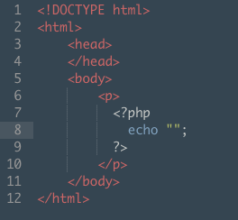
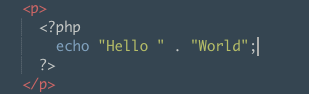
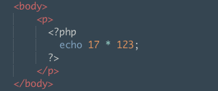

<h1>Here to meet Richard Dreyfuss</h1>

As we learned from Mike Dang, PHP can be inbeded in the html as seen below:

Meet PHP

<h4>Why Do We Need PHP?</h4>

While PHP can look and act really similar to Javascript, JScript's knowledge can be limited. While Javascript is usually run in the browser(client), PHP runs only on the server.

<h4>IMPORTANT: When running PHP in our html files, we'll rename "index.html" to "index.php" so that php interpreter can evaluate PHP code.</h4>

<h3> Lets Jump In</h3>
<h4>Strings and Such:</h4>

As you may have noticed from the example above, the "echo" function outputs strings and needs a semicolon in order for the string to render. You can also concat using " . " between data. ex: 

 We can just as easily use the "echo" function to render math equastions. 

<h5>Getting Into Variables:</h5>

 Variables are indicated by the "$" sign

<code>$myName = "Richard Dreyfuss";</code>
<code>$myAge = 68;</code>

