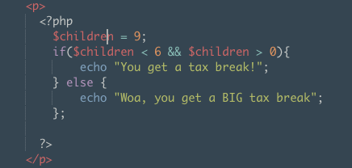
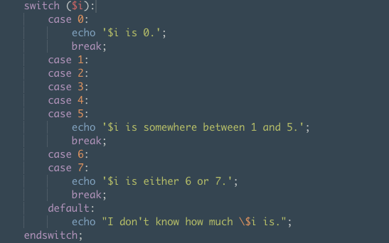

<h1>PHP... The Goldie Locks Planet!</h1>
<h5>As we learned from Mike Dang, PHP can be inbeded in the html as seen below:</h5>

FROM WIKIPEDIA:

PHP is a server-side scripting language designed for web development but also used as a general-purpose programming language. Originally created by Rasmus Lerdorf in 1994, the PHP reference implementation is now produced by The PHP Group. PHP originally stood for Personal Home Page, but it now stands for the recursive acronym PHP: Hypertext Preprocessor.

Meet PHP

<h4>Why Do We Need PHP?</h4>

While PHP can look and act really similar to Javascript, JScript's knowledge can be limited. While Javascript is usually run in the browser(client), PHP runs only on the server.

<h4>IMPORTANT: When running PHP in our html files, we'll rename "index.html" to "index.php" so that php interpreter can evaluate PHP code.</h4>

<h2> Lets Jump In</h2>
<h4>Strings and Such:</h4>

As you may have noticed from the example above, the "echo" function outputs strings and needs a semicolon in order for the string to render. You can also concatenate using " . " between data. ex: 

 We can just as easily use the "echo" function to render math equations. 

<h5>Getting Into Variables:</h5>

 Variables are indicated by the "$" sign

<code>$myName = "Richard Dreyfuss";</code>
 
<code>$myAge = 68;</code>

 Now let's use this varaible knowledge to set conditional statements. It looks SUPER similar to JavaScript

Control flows like switch case can be slightly different syntax from Javascript. Instead of bracket notation in this switchcase, we use and semicolon and "endswitch"

